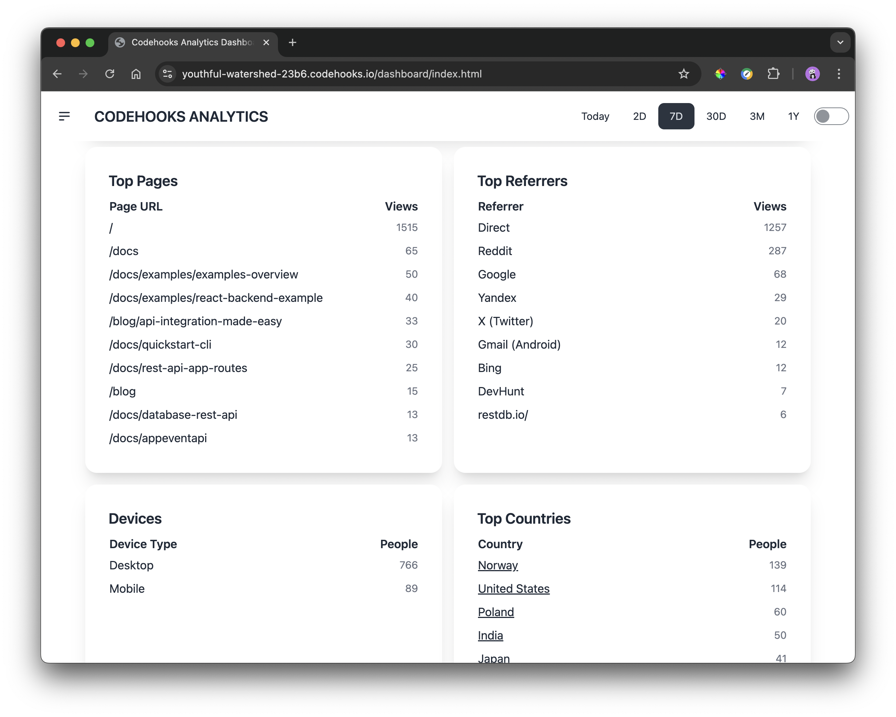
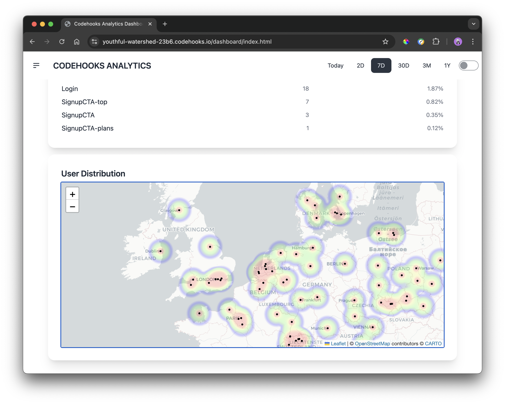

# Codehooks Analytics

Codehooks Analytics is an open source web analytics tool to track any website(s) and application(s) traffic. 
This self-hosted (https://codehooks.io) solution gives you full control over your data and the analytics application itself.
The application can be deployed as-is, modified, or used as a starting point for your own custom analytics solution.

Codehooks Analytics is developed with [Codehooks.io](https://codehooks.io) as the backend service and [Alpine.js](https://alpinejs.dev/), [TailwindCSS](https://tailwindcss.com/) and [DaisyUI](https://daisyui.com/) for the frontend dashboard.


## Features

- Track page views and user interactions
- User authentication system
- OpenAI AI Advisor for insights and recommendations
- Custom event tracking
- Real-time analytics dashboard
- Easy integration with your existing websites
- Supports multiple domains
- Geolocation data

## Dashboard Screenshots

The dashboard provides an overview of the website traffic and user interactions.




The heatmap shows you where your users are clicking on a world map. The map is powered by the open source solution [OpenStreetMap](https://openstreetmap.org/).



Secure user/password authentication by username and password. The authentication is powered by the open source  package [codehooks-auth](https://www.npmjs.com/package/codehooks-auth).


## Installation and Setup

Install the dependencies and set up the project using the following steps:
1. [Install Node.js and npm](#prerequisites)
2. [Install the Codehooks CLI](#prerequisites)
3. [Clone the repository](#installation)
4. [Install the dependencies](#installation)
5. [Set up the environment variables](#configuration)
6. [Deploy the application](#deploying-the-application)
7. [Create a new user](#creating-a-new-user)
8. [Integrate the Web Analytics Client JavaScript](#integrating-the-web-analytics-client-javascript)
9. [Access the dashboard](#dashboard-access)

### Prerequisites

- Node.js (v14 or later)
- npm (v6 or later)
- A [Codehooks.io](https://codehooks.io/) account for backend services

### Installation

1. Clone the repository:
   ```
   git clone https://github.com/RestDB/webanalytics.git
   cd webanalytics
   ```

2. Install dependencies:
   ```
   npm install
   ```

3. Create a new project at [codehooks.io](https://codehooks.io/) and get attached to your project.
   ```
   coho init --empty
   ```

### Configuration and environment variables

1. Set up JWT secrets for authentication:
   ```
   coho set-env JWT_ACCESS_TOKEN_SECRET 'your_access_token_secret' --encrypted
   coho set-env JWT_REFRESH_TOKEN_SECRET 'your_refresh_token_secret' --encrypted
   ```
   Tip: Use [`uuidgen`](https://man7.org/linux/man-pages/man1/uuidgen.1.html) to generate random secrets.

2. Create a new API key:
   ```
   coho add-token
   ```
   Note the token output for future use.

3. Create a user and a traffic collection:
   ```
   coho createcollection users
   coho createcollection traffic
   ```
4. Configure the Geolocation API token `IPINFO_TOKEN` environment variable:
   Sign up for an account at [ipinfo.io](https://ipinfo.io/). They offer a free tier that should be more than enough for personal use.

   ```
   coho set-env IPINFO_TOKEN 'your_token_here' --encrypted
   ```
5. Configure the OpenAI API key `OPENAI_API_KEY` environment variable:
   Get your API key from [OpenAI](https://platform.openai.com/api-keys).

   ```
   coho set-env OPENAI_API_KEY 'your_api_key_here' --encrypted
   ```

## Usage

### Deploying the Application

Deploy the application to the cloud:

```
npm run deploy
```

### Creating a New User

Use the following curl command to create a new user:

```
curl --location 'https://your-coho-app-url.codehooks.io/auth/createuser' \
--header 'x-apikey: YOUR_API_KEY' \
--header 'Content-Type: application/json' \
--data-raw '{
    "username": "user@example.com", 
    "password": "SecurePassword123!"
}'
```
Tip: create a secure password using [`openssl`](https://www.openssl.org/docs/man1.0.2/man1/openssl.html)
```
openssl rand -base64 32
```

Replace `YOUR_API_KEY` with your project API token. Check the [docs](https://www.codehooks.io/docs/authentication#app-to-app-authentication-with-api-tokens) on how to create an API token.

### Integrating the Web Analytics Client JavaScript

Add the following script tag to your website's HTML:

```html
<script src="https://your-coho-app-url.codehooks.io/script.js" referrerpolicy="no-referrer-when-downgrade"></script>
```

## The Dashboard Application

The dashboard application is an [Alpine.js](https://alpinejs.dev/), [TailwindCSS](https://tailwindcss.com/), and [DaisyUI](https://daisyui.com/) application that provides a detailed view of the website traffic and user interactions. It is deployed with the rest of the app under the `/dashboard` route:

```js
app.static({route: '/dashboard', directory: '/pages', default: 'index.html'})
```

The source code can be found under the `pages` directory.

```
pages
├── index.html // Dashboard
├── output.css // TailwindCSS
└── script.js  // Alpine.js and API queries for traffic data
```

## Dashboard Access
The analytics dashboard can be accessed at:
`https://your-coho-app-url.codehooks.io` or `your-domain.com`

## API Documentation

**API Overview**

Here's a quick overview of the main API endpoints. For detailed information, please refer to the full [API Documentation](#api-documentation) below.

### Authentication
All API endpoints require authentication using either a JWT Bearer token or an API key.

#### Headers
- `Authorization: Bearer <jwt_token>`
- or
- `x-apikey: <your_api_key>`

### Endpoints

1. [Get Aggregated Statistics](#get-aggregated-statistics)
   - Method: GET
   - Endpoint: `/api/aggstats/:from/:to`
   - Query Parameters:
     - `domain`: The domain to filter statistics for
   - Description: Provides aggregated statistics for a specified date range

2. [Post Traffic Data](#post-traffic-data-programmatically)
   - Method: POST
   - Endpoint: `/api/stats`
   - Query Parameters:
     - `domain`: The domain to post statistics for
   - Body: JSON object containing traffic data
   - Description: Allows posting traffic data programmatically

3. [Get AI Assist Insights](#get-ai-assist-insights)
   - Method: GET
   - Endpoint: `/api/aiassist`
   - Query Parameters:
     - `domain`: The domain to generate insights for
   - Description: Provides AI-generated insights and recommendations based on analytics data

4. [Create User](#create-user)
   - Method: POST
   - Endpoint: `/auth/createuser`
   - Headers:
     - `x-apikey: <your_api_key>`
   - Body: JSON object with `username` and `password`
   - Description: Creates a new user account

### Get aggregated Statistics

Endpoint: `GET /api/aggstats/:from/:to`

This endpoint provides aggregated statistics for a specified date range.

#### Parameters:

- `from`: Start date (inclusive) in ISO 8601 format (e.g., "2023-04-01T00")
- `to`: End date (inclusive) in ISO 8601 format (e.g., "2023-04-30T23:59")
- `domain`: (Query parameter) The domain to filter statistics for (e.g., "codehooks.io")

#### Request:

```
GET https://your-coho-app-url.codehooks.io/api/aggstats/2024-10-05T00/2024-10-05T23?domain=codehooks.io
```

#### Headers:

- `Authorization`: Bearer token (JWT)
- Or
- `x-apikey`: Your API key

#### Response:

```json
{
  "uniqueUsers": 45,
  "totalPageViews": 199,
  "uniqueEvents": 3,
  "totalPageEvents": 23,
  "averageSessionDuration": {
    "hours": "03",
    "minutes": "37",
    "seconds": "17"
  },
  "bounceRate": "60.00",
  "topPages": [
    { "url": "https://codehooks.io/", "views": 107 },
    { "url": "https://codehooks.io/docs", "views": 11 },
    { "url": "https://codehooks.io/docs/quickstart-cli", "views": 10 }
  ],
  "topReferers": [
    { "url": "Direct", "views": 158 },
    { "url": "Reddit", "views": 8 },
    { "url": "Google", "views": 5 }
  ],
  "topCountries": [
    { "country": "Norway", "views": 13 },
    { "country": "Brazil", "views": 8 },
    { "country": "Canada", "views": 6 }
  ],
  "topEvents": [
    { "event": "PricingCTA", "views": 10 },
    { "event": "ImageCarouselSwiped", "views": 9 },
    { "event": "Login", "views": 4 }
  ],
  "pageViewsInPeriod": {
    "2024-10-05T00:00": 5,
    "2024-10-05T01:00": 3,
    "2024-10-05T02:00": 7,
    "2024-10-05T03:00": 12,
    "2024-10-05T04:00": 6,
    "2024-10-05T05:00": 2,
    "2024-10-05T06:00": 10,
    "2024-10-05T07:00": 7,
    "2024-10-05T08:00": 12,
    "2024-10-05T09:00": 28,
    "2024-10-05T10:00": 17,
    "2024-10-05T11:00": 15,
    "2024-10-05T12:00": 2,
    "2024-10-05T13:00": 1
  },
  "deviceTypes": {
    "desktop": 37,
    "mobile": 8
  },
  "geoLocCounts": [
    {
      "geoloc": {
        "lat": -10.9111,
        "lon": -37.0717
      },
      "count": 96
    }
    // ... more geolocation entries ...
  ]
}
```

#### Response Fields:

| Field | Description |
|-------|-------------|
| `uniqueUsers` | Number of unique visitors |
| `totalPageViews` | Total number of page views in the date range |
| `uniqueEvents` | Number of unique event types |
| `totalPageEvents` | Total number of events triggered |
| `averageSessionDuration` | Average time on site in hours, minutes, and seconds |
| `bounceRate` | Bounce rate as a percentage |
| `topPages` | Array of top pages with their view counts |
| `topReferers` | Array of top referrers with their view counts |
| `topCountries` | Array of top countries with their view counts |
| `topEvents` | Array of top events with their trigger counts |
| `pageViewsInPeriod` | Object containing page views per hour |
| `deviceTypes` | Breakdown of visits by device type |
| `geoLocCounts` | Array of geolocation data with view counts |
| `geoLocCounts.geoloc` | Object containing latitude and longitude |
| `geoLocCounts.count` | Number of views from this location |

#### Error Responses:

- 400 Bad Request: Invalid date format
- 401 Unauthorized: Missing or invalid authentication
- 403 Forbidden: Insufficient permissions
- 500 Internal Server Error: Server-side error

### Post Traffic Data programmatically

Endpoint: `POST /api/stats`

This endpoint allows you to post traffic data programmatically.

#### Parameters:  

- `domain`: (Query parameter) The domain to filter statistics for (e.g., "codehooks.io")
- `data`: (Body parameter) The traffic data to post in JSON format

#### Request:

```
POST https://your-coho-app-url.codehooks.io/api/stats?domain=codehooks.io
Content-Type: application/json

{
  "referer": "https://example.com/login",
  "event": "Login",
  "eventData": {
    "username": "user@example.com"
  }
}
```

#### Response:

```
HTTP/1.1 201 OK
Content-Type: application/json

{
  "_id": "1234567890",
  "referer": "https://example.com/login",
  "event": "Login",
  "eventData": {
    "username": "user@example.com"
  },
  "timestamp": "2024-02-14T12:34:56Z"
}
``` 

### Get AI Assist Insights

```
GET /api/aiassist
```

This endpoint provides AI-assisted functionality for the analytics dashboard. It leverages artificial intelligence to offer insights, suggestions, or automated analysis based on the collected analytics data.

#### Usage

Send a GET request to `/api/aiassist` to receive AI-generated assistance. The specific functionality and response format will depend on the implementation in the `aiassist.js` file.

#### Parameters

- `domain`: (Query parameter, required) The domain to generate insights for (e.g., "codehooks.io")

#### Example Request

```
GET https://your-coho-app-url.codehooks.io/api/aiassist?domain=codehooks.io
```

#### Headers

- `Authorization`: Bearer token (JWT)
- Or
- `x-apikey`: Your API key

#### Response

The response will contain AI-generated insights or recommendations based on the analytics data for the specified domain. The exact format and content of the response will depend on the implementation of the `aiassist` function.

Example response:

```json
{
    "lastUpdated": "2024-10-11T12:00:00Z",
    "ingress": "some text here...",
    "recommendations": [
        "some recommendation here...",
        "another recommendation here..."
    ],
    "summary": "some summary here...",
    "key insights": [
        "some key insight here...",
        "another key insight here..."
    ],
    "data-driven recommendations": [
        "some data-driven recommendation here...",
        "another data-driven recommendation here..."
    ],
    "unusual patterns or anomalies or fun facts": [
        "some unusual pattern or anomaly or fun fact here...",
        "another unusual pattern or anomaly or fun fact here..."
    ]
}
```

#### Error Responses

- 400 Bad Request: Missing or invalid domain parameter
- 401 Unauthorized: Missing or invalid authentication
- 403 Forbidden: Insufficient permissions
- 500 Internal Server Error: Server-side error

### Create User

Endpoint: `POST /auth/createuser`

This endpoint allows you to create a new user account.

#### Headers:

- `x-apikey`: Your API key

#### Body:

JSON object with the following properties:
- `username`: The email address of the new user
- `password`: The password for the new user

#### Request:

```
POST https://your-coho-app-url.codehooks.io/auth/createuser
Content-Type: application/json
x-apikey: YOUR_API_KEY

{
    "username": "user@example.com",
    "password": "SecurePassword123!"
}
```

#### Response:

```json
{
  "id": "user_1234567890",
  "username": "user@example.com",
  "created": "2024-02-14T12:34:56Z"
}
```

#### Error Responses:

- 400 Bad Request: Missing or invalid username or password
- 401 Unauthorized: Invalid API key
- 409 Conflict: Username already exists
- 500 Internal Server Error: Server-side error

#### Notes:

- The password should be sufficiently strong. It's recommended to use a combination of uppercase and lowercase letters, numbers, and special characters.
- For security reasons, the password is not returned in the response.
- This endpoint should only be used by administrators to create new accounts. Regular user registration should be handled through a separate, rate-limited endpoint.

## Environment Variables

### IPINFO_TOKEN

The `IPINFO_TOKEN` is an environment variable used to authenticate requests to the IPInfo API. This token is required to fetch geolocation data based on IP addresses.

To set up the `IPINFO_TOKEN`:

1. Sign up for an account at [ipinfo.io](https://ipinfo.io/). They offer a free tier that should be more than enough for personal use.
2. Obtain your API token from your account dashboard
3. Set the environment variable in your project:
   - Use the Studio interface to set the environment variable
   -Or use the CLI:
     ```
     coho set-env IPINFO_TOKEN 'your_token_here' --encrypted
     ```

Make sure to keep your API token secret and never commit it to version control.

The `IPINFO_TOKEN` is used in the `getCountryFromIP` function in `utils.js` to authenticate requests to the IPInfo API.

### OPENAI_API_KEY

The `OPENAI_API_KEY` is an environment variable used to authenticate requests to the OpenAI API.

1. Get your API key from [OpenAI](https://platform.openai.com/api-keys).
2. Set the environment variable in your project:
```
coho set-env OPENAI_API_KEY 'your_api_key_here' --encrypted
```

### JWT_ACCESS_TOKEN_SECRET

The `JWT_ACCESS_TOKEN_SECRET` is an environment variable used to sign and verify JSON Web Tokens (JWTs) for user authentication.

To set up the `JWT_ACCESS_TOKEN_SECRET`:

1. Generate a secure random string. You can use the `uuidgen` command or a similar method to create a strong secret.
2. Set the environment variable in your project:
   ```
   coho set-env JWT_ACCESS_TOKEN_SECRET 'your_access_token_secret' --encrypted
   ```

Make sure to keep this secret secure and never commit it to version control.

The `JWT_ACCESS_TOKEN_SECRET` is used in the authentication process to sign JWTs when users log in and to verify JWTs when accessing protected routes.

### JWT_REFRESH_TOKEN_SECRET

The `JWT_REFRESH_TOKEN_SECRET` is an environment variable used to sign and verify refresh tokens for user authentication.

To set up the `JWT_REFRESH_TOKEN_SECRET`:

1. Generate a secure random string. You can use the `uuidgen` command or a similar method to create a strong secret.
2. Set the environment variable in your project:
   ```
   coho set-env JWT_REFRESH_TOKEN_SECRET 'your_refresh_token_secret' --encrypted
   ```

Make sure to keep this secret secure and never commit it to version control.

The `JWT_REFRESH_TOKEN_SECRET` is used in the authentication process to sign refresh tokens when users log in and to verify refresh tokens when issuing new access tokens.

## Contributing

We welcome contributions! Please see our [Contributing Guide](CONTRIBUTING.md) for more details.

## License

This project is licensed under the MIT License - see the [LICENSE](LICENSE) file for details.

## Support

If you encounter any issues or have questions, please file an issue on our [GitHub issue tracker](https://github.com/yourusername/webanalytics/issues).