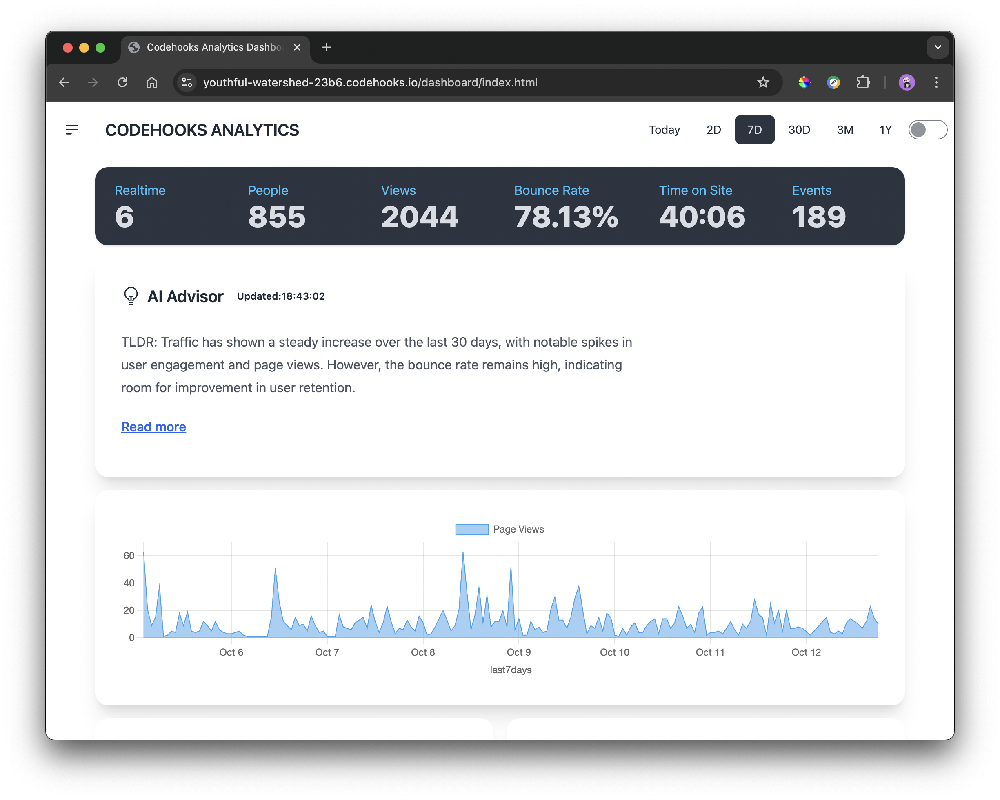

# WebAnalytics

WebAnalytics is a custom web analytics tool to track your website traffic. This self-hosted (https://codehooks.io) solution gives you full control over your data and analytics.

## Features

- Track page views and user interactions
- User authentication system
- Custom event tracking
- Real-time analytics dashboard
- Easy integration with your existing websites

## Screenshots
User authentication is solved by using the NPM package [codehooks-auth](https://www.npmjs.com/package/codehooks-auth)


The dashboard provides an overview of the website traffic and user interactions.



## Prerequisites

- Node.js (v14 or later)
- npm (v6 or later)
- A [Codehooks.io](https://codehooks.io/) account for backend services

## Installation

1. Clone the repository:
   ```
   git clone https://github.com/yourusername/webanalytics.git
   cd webanalytics
   ```

2. Install dependencies:
   ```
   npm install
   ```

3. Create a new project at [codehooks.io](https://codehooks.io/) and get attached to your project.
   ```
   coho init --empty
   ```

## Configuration

1. Set up JWT secrets for authentication:
   ```
   coho set-env JWT_ACCESS_TOKEN_SECRET 'your_access_token_secret' --encrypted
   coho set-env JWT_REFRESH_TOKEN_SECRET 'your_refresh_token_secret' --encrypted
   ```
   Tip: Use [`uuidgen`](https://man7.org/linux/man-pages/man1/uuidgen.1.html) to generate random secrets.

2. Create a new API key:
   ```
   coho add-token
   ```
   Note the token output for future use.

3. Create a user collection:
   ```
   coho createcollection users
   ```

## Usage

### Deploying the Application

Deploy the application to the cloud:

```
npm run deploy
```

### Creating a New User

Use the following curl command to create a new user:

```
curl --location 'https://your-coho-app-url.codehooks.io/auth/createuser' \
--header 'x-apikey: YOUR_API_KEY' \
--header 'Content-Type: application/json' \
--data-raw '{
    "username": "user@example.com", 
    "password": "SecurePassword123!"
}'
```
Tip: create a secure password using [`openssl`](https://www.openssl.org/docs/man1.0.2/man1/openssl.html)
```
openssl rand -base64 32
```

Replace `YOUR_API_KEY` with your project API token. Check the [docs](https://www.codehooks.io/docs/authentication#app-to-app-authentication-with-api-tokens) on how to create an API token.

### Integrating the Web Analytics Client JavaScript

Add the following script tag to your website's HTML:

```html
<script src="https://your-coho-app-url.codehooks.io/script.js"></script>
```

## The Dashboard Application

The dashboard application is an [Alpine.js](https://alpinejs.dev/), [TailwindCSS](https://tailwindcss.com/), and [DaisyUI](https://daisyui.com/) application that provides a detailed view of the website traffic and user interactions. It is deployed with the rest of the app under the `/dashboard` route:

```js
app.static({route: '/dashboard', directory: '/pages', default: 'index.html'})
```

The source code can be found under the `pages` directory.

```
pages
├── index.html
├── input.css
├── output.css
└── script.js
```


## API Documentation

### Get aggregated Statistics

Endpoint: `GET /api/aggstats/:from/:to`

This endpoint provides aggregated statistics for a specified date range.

#### Parameters:

- `from`: Start date (inclusive) in ISO 8601 format (e.g., "2023-04-01T00")
- `to`: End date (inclusive) in ISO 8601 format (e.g., "2023-04-30T23:59")
- `domain`: (Query parameter) The domain to filter statistics for (e.g., "codehooks.io")

#### Request:

```
GET https://your-coho-app-url.codehooks.io/api/aggstats/2024-10-05T00/2024-10-05T23?domain=codehooks.io
```

#### Headers:

- `Authorization`: Bearer token (JWT)
- Or
- `x-apikey`: Your API key

#### Response:

```json
{
  "uniqueUsers": 45,
  "totalPageViews": 199,
  "uniqueEvents": 3,
  "totalPageEvents": 23,
  "averageSessionDuration": {
    "hours": "03",
    "minutes": "37",
    "seconds": "17"
  },
  "bounceRate": "60.00",
  "topPages": [
    { "url": "https://codehooks.io/", "views": 107 },
    { "url": "https://codehooks.io/docs", "views": 11 },
    { "url": "https://codehooks.io/docs/quickstart-cli", "views": 10 }
  ],
  "topReferers": [
    { "url": "Direct", "views": 158 },
    { "url": "Reddit", "views": 8 },
    { "url": "Google", "views": 5 }
  ],
  "topCountries": [
    { "country": "Norway", "views": 13 },
    { "country": "Brazil", "views": 8 },
    { "country": "Canada", "views": 6 }
  ],
  "topEvents": [
    { "event": "PricingCTA", "views": 10 },
    { "event": "ImageCarouselSwiped", "views": 9 },
    { "event": "Login", "views": 4 }
  ],
  "pageViewsPerHour": [63, 21, 9, 15, 38, 1, 2, 5, 4, 18, 9, 14, 0, 0, 0, 0, 0, 0, 0, 0, 0, 0, 0, 0],
  "pageViewsPerDayOfWeek": [0, 0, 0, 0, 0, 0, 199],
  "pageViewsPerDayOfMonth": [0, 0, 0, 0, 199, 0, 0, 0, 0, 0, 0, 0, 0, 0, 0, 0, 0, 0, 0, 0, 0, 0, 0, 0, 0, 0, 0, 0, 0, 0, 0],
  "pageViewsPerMonth": [0, 0, 0, 0, 0, 0, 0, 0, 0, 199, 0, 0],
  "deviceTypes": {
    "desktop": 37,
    "mobile": 8
  },
  "geoLocCounts": [
    {
      "geoloc": {
        "lat": -10.9111,
        "lon": -37.0717
      },
      "count": 96
    }
    // ... more geolocation entries ...
  ]
}
```

#### Response Fields:

| Field | Description |
|-------|-------------|
| `uniqueUsers` | Number of unique visitors |
| `totalPageViews` | Total number of page views in the date range |
| `uniqueEvents` | Number of unique event types |
| `totalPageEvents` | Total number of events triggered |
| `averageSessionDuration` | Average time on site in hours, minutes, and seconds |
| `bounceRate` | Bounce rate as a percentage |
| `topPages` | Array of top pages with their view counts |
| `topReferers` | Array of top referrers with their view counts |
| `topCountries` | Array of top countries with their view counts |
| `topEvents` | Array of top events with their trigger counts |
| `pageViewsPerHour` | Array of page views for each hour (0-23) |
| `pageViewsPerDayOfWeek` | Array of page views for each day of the week (0-6, where 0 is Sunday) |
| `pageViewsPerDayOfMonth` | Array of page views for each day of the month (1-31) |
| `pageViewsPerMonth` | Array of page views for each month (0-11, where 0 is January) |
| `deviceTypes` | Breakdown of visits by device type |
| `geoLocCounts` | Array of geolocation data with view counts |
| `geoLocCounts.geoloc` | Object containing latitude and longitude |
| `geoLocCounts.count` | Number of views from this location |

#### Error Responses:

- 400 Bad Request: Invalid date format
- 401 Unauthorized: Missing or invalid authentication
- 403 Forbidden: Insufficient permissions
- 500 Internal Server Error: Server-side error

### Post Traffic Data programmatically

Endpoint: `POST /api/stats`

This endpoint allows you to post traffic data programmatically.

#### Parameters:  

- `domain`: (Query parameter) The domain to filter statistics for (e.g., "codehooks.io")
- `data`: (Body parameter) The traffic data to post in JSON format

#### Request:

```
POST https://your-coho-app-url.codehooks.io/api/stats?domain=codehooks.io
Content-Type: application/json

{
  "data": {
    "referer": "https://example.com/login",
    "event": "Login",
    "eventData": {
      "username": "user@example.com"
    }
  }
}
```

#### Response:

```
HTTP/1.1 201 OK
Content-Type: application/json

{
  "_id": "1234567890",
  "referer": "https://example.com/login",
  "event": "Login",
  "eventData": {
    "username": "user@example.com"
  },
  "timestamp": "2024-02-14T12:34:56Z"
}
``` 

## Dashboard

Access your analytics dashboard at `https://your-coho-app-url.codehooks.io | your-domain.com/dashboard`


## Environment Variables

### IPINFO_TOKEN

The `IPINFO_TOKEN` is an environment variable used to authenticate requests to the IPInfo API. This token is required to fetch geolocation data based on IP addresses.

To set up the `IPINFO_TOKEN`:

1. Sign up for an account at [ipinfo.io](https://ipinfo.io/). They offer a free tier that should be more than enough for personal use.
2. Obtain your API token from your account dashboard
3. Set the environment variable in your project:
   - Use the Studio interface to set the environment variable
   -Or use the CLI:
     ```
     coho set-env IPINFO_TOKEN 'your_token_here' --encrypted
     ```

Make sure to keep your API token secret and never commit it to version control.

The `IPINFO_TOKEN` is used in the `getCountryFromIP` function in `utils.js` to authenticate requests to the IPInfo API.

### JWT_ACCESS_TOKEN_SECRET

The `JWT_ACCESS_TOKEN_SECRET` is an environment variable used to sign and verify JSON Web Tokens (JWTs) for user authentication.

To set up the `JWT_ACCESS_TOKEN_SECRET`:

1. Generate a secure random string. You can use the `uuidgen` command or a similar method to create a strong secret.
2. Set the environment variable in your project:
   ```
   coho set-env JWT_ACCESS_TOKEN_SECRET 'your_access_token_secret' --encrypted
   ```

Make sure to keep this secret secure and never commit it to version control.

The `JWT_ACCESS_TOKEN_SECRET` is used in the authentication process to sign JWTs when users log in and to verify JWTs when accessing protected routes.

### JWT_REFRESH_TOKEN_SECRET

The `JWT_REFRESH_TOKEN_SECRET` is an environment variable used to sign and verify refresh tokens for user authentication.

To set up the `JWT_REFRESH_TOKEN_SECRET`:

1. Generate a secure random string. You can use the `uuidgen` command or a similar method to create a strong secret.
2. Set the environment variable in your project:
   ```
   coho set-env JWT_REFRESH_TOKEN_SECRET 'your_refresh_token_secret' --encrypted
   ```

Make sure to keep this secret secure and never commit it to version control.

The `JWT_REFRESH_TOKEN_SECRET` is used in the authentication process to sign refresh tokens when users log in and to verify refresh tokens when issuing new access tokens.

## Contributing

We welcome contributions! Please see our [Contributing Guide](CONTRIBUTING.md) for more details.

## License

This project is licensed under the MIT License - see the [LICENSE](LICENSE) file for details.

## Support

If you encounter any issues or have questions, please file an issue on our [GitHub issue tracker](https://github.com/yourusername/webanalytics/issues).